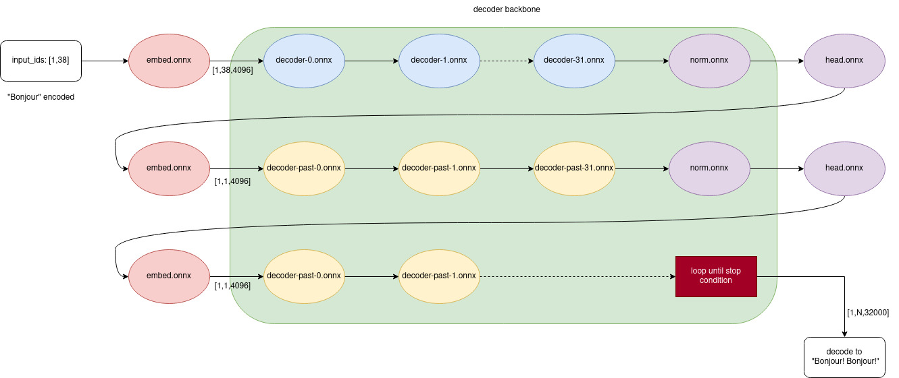

# llama.onnx

I'm here to release

* llama 7B onnx models
* and a 400-lines python script **without torch** to run it

So you can quantize the model partially and optimize kernel step by step. 

## How to use
Please download it here
* huggingface https://huggingface.co/tpoisonooo/llama.onnx/tree/main
* BaiduYun https://pan.baidu.com/s/195axYNz79U6YkJLETNJmXw?pwd=onnx

These models converted from [alpaca huggingface](https://github.com/tatsu-lab/stanford_alpaca), here is the graph to call them:



Try `onnxruntime` demo, no `torch` required, and the precision has been checked.

```bash
$ python3 -m pip install -r requirements.txt
$ python3 demo-single.py ${ONNX_DIR} "bonjour"
..
Bonjour.
```

## Updates

2023/04/?? add memory plan, add temperature warp

2023/04/07 add [onnxruntime demo](demo-single.py) and `tokenizer.model` (don't forget to download it)

2023/04/05 init project


## Notes
1. Any `logits_warper` or `logits_processor` or `BeamSearch` not implemented, so the result would be not good. **Please wait for nexxxxt version !!!**
2. I have compared the output values of `onnxruntime-cpu` and `torch-cuda`, and the maximum error is 0.002, not bad
3. The current state is equivalent to these configurations
```bash
temperature=1.0
total_tokens=2000
top_p=1.0
top_k=None
repetition_penalty=1.0
```


## Acknowlegements
* [alpaca](https://github.com/tatsu-lab/stanford_alpaca)
* [llama](https://github.com/facebookresearch/llama)
* [transformers](https://github.com/huggingface/transformers)
* [peft](https://github.com/huggingface/peft)


## License
[GPLv3](LICENSE) and [why](why-gpl.md)
