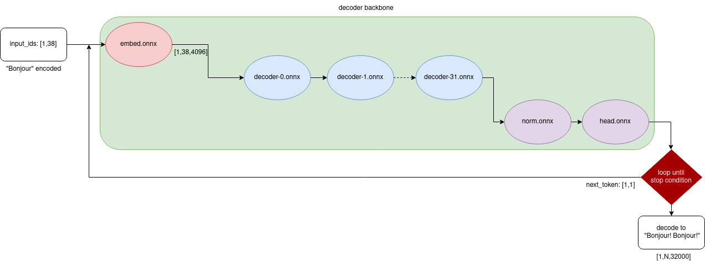

# LLaMa/RWKV onnx

Download onnx models here:

| Model | Precision | Size | URL | Standalone Demo |
| :-: | :-: | :-: | :-: | :-: |
| LLaMa-7B | fp32 | 26GB | [huggingface](https://huggingface.co/tpoisonooo/alpaca.onnx/tree/main) | [demo_llama.py](./demo_llama.py) |
| LLaMa-7B | fp16 | 13GB | [huggingface](https://huggingface.co/tpoisonooo/alpaca.onnx/tree/fp16) or [硬件模型库](https://platform.openmmlab.com/deploee) | [demo_llama.py](./demo_llama.py) |
| RWKV-4-palm-430M | fp16 |  920MB | [huggingface](https://huggingface.co/tpoisonooo/rwkv.onnx/tree/RWKV-4-Pile-430M-20220808-8066) or [硬件模型库](https://platform.openmmlab.com/deploee) | [demo_rwkv.py](./demo_rwkv.py) |


## News

05/18 release RWKV-4 onnx models, standalone script and [LLM structure comparison](https://zhuanlan.zhihu.com/p/629821901)

05/09 trt output wrong value until [issue 2928](https://github.com/NVIDIA/TensorRT/issues/2928) solved

04/19  [remove GPTQ zero point guidance](docs/remove-GPTQ-zero-point.md)

04/18 export mixed-precision quant table from [GPTQ-for-LLaMa](https://github.com/qwopqwop200/GPTQ-for-LLaMa/pull/189)

04/11 add 13GB onnx-fp16 models

04/11 add memory pool, support 2GB RAM laptop :star:

04/10 reduce onnx model size to 26GB

04/10 support `temperature` add `topk` logits warp

04/07 add [onnxruntime demo](demo-single.py)

04/05 init project


## Features

* Release LLaMa-7B and RWKV-400M onnx models and their onnxruntime standalone demo
* No `torch` or `transformers` required
* Support memory pool, works on 2GB laptop/PC (very slow :turtle:)

Why do this ?
1. **Visualization**. `graphviz` crashed on LLaMa model. LLM visualization tool must support nest or operator folding feature
2. **Quatization**. LLM often repeat itself, just like [fractal](https://raw.githubusercontent.com/taichi-dev/public_files/master/taichi/fractal_small.gif). For LLaMa quantization, loading part of decoder backbone would be enough (400MB). It could be quantized partially
3. **Embeded device**. Small board IO error occurs when `dd` a big single file
4. **Distributed system**. Inference LLM on many hybrid (FPGA/NPU/GPGPU) devices would be simple
5. **onnx tools**. Device manufacturer has support onnx well, there is no reason to neglect it

## Usage

Here is the graph to call LLaMa (RWKV is similar):



Try LLaMa `onnxruntime` demo, no `torch` required, and the precision has been checked.

```bash
$ python3 -m pip install -r requirements.txt
$ python3 demo_llama.py ${FP16_ONNX_DIR} "bonjour"
..
# If you only have 4GB memory, use `--poolsize`
$ python3 demo_llama.py ${FP16_ONNX_DIR} "bonjour" --poolsize 4
..
Bonjour.

# Try more options
$ python3 demo_llama.py --help
```

Use [demo_rwkv.py](./demo_rwkv.py) to run RWKV:
```bash
$ python3 demo_rwkv.py ${FP16_ONNX_DIR}
```


## Export RWKV onnx
1. git clone [RWKV](https://github.com/BlinkDL/ChatRWKV) and download its models
2. copy [onnx_RWKV_in_150_lines.py](tools/onnx_RWKV_in_150_lines.py) to ChatRWKV

```bash
$ git clone https://github.com/BlinkDL/ChatRWKV --depth=1
$ cp llama.onnx/tools/onnx_RWKV_in_150_lines.py  ChatRWKV
$ cd ChatRWKV
$ mkdir models
$ python3 onnx_RWKV_in_150_lines.py
```
  
Then you would get onnx files.

```bash
$ ls -lah models
..
```

## Export LLaMa onnx

**STEP1 Convert to HF format**

These models converted from [alpaca huggingface](https://github.com/tatsu-lab/stanford_alpaca).

- If you are using [LLaMa](https://github.com/facebookresearch/llama) or [llama.cpp](https://github.com/ggerganov/llama.cpp), convert it to HF format first. Here are steps:
    ```bash
    # install transformers master
    $ git clone https://github.com/huggingface/transformers
    $ cd transformers && python3 setup.py install
    ..
    $ cd src/transformers
    $ python3 src/transformers/models/llama/convert_llama_weights_to_hf.py  --input_dir ${LLaMa_PATH}  --model_size 7B  --output_dir ${HF_PATH}
    ```

- If you are using [alpaca-lora](https://github.com/tloen/alpaca-lora), use [this script](https://github.com/ymcui/Chinese-LLaMA-Alpaca/blob/main/scripts/merge_llama_with_chinese_lora_to_hf.py) to merge LoRA weights.

- If you are using [alpaca](https://github.com/tatsu-lab/stanford_alpaca), go STEP2.

**STEP2 `torch.onnx.export`**

Checkout transformers to this [hacking branch](https://github.com/tpoisonooo/transformers/tree/add-convert), run single inference.

```bash
$ python3 tools/export-onnx.py ${PATH_ALPACA_7B}
```

**STEP3 convert to fp16/tvm**

Use `onnxconverter-common.float16`

```bash
$ cd tools
$ python3 -m pip install -r requirements.txt
$ python3 convert-fp32-to-fp16.py ${FP32_PATH} ${FP16_PATH}
```

Or use `relay.vm` to convert tvm
```bash
$ cd tools
$ python3 convert-to-tvm.py ${ONNX_PATH} ${OUT_DIR}
```

## Notes
1. For model structure, please read [LLaMa 和 RWKV 结构对比](https://zhuanlan.zhihu.com/p/629821901)
2. I have compared the output values of `onnxruntime-cpu` and `torch-cuda`, and the maximum error is 0.002, not bad
3. The current `demo_llama.py` state is equivalent to these configurations
```bash
temperature=0.1
total_tokens=2000
top_p=1.0
top_k=40
repetition_penalty=1.0
```
4. Mixed-precision kernel optimization is on the way. [Here](docs/remove-GPTQ-zero-point.md) is a part of guidance.


## Acknowlegements
* [RWKV](https://github.com/BlinkDL/ChatRWKV)
* [LLaMa](https://github.com/facebookresearch/llama)
* [alpaca](https://github.com/tatsu-lab/stanford_alpaca)
* [alpaca-lora](https://github.com/tloen/alpaca-lora)
* [transformers](https://github.com/huggingface/transformers)
* [peft](https://github.com/huggingface/peft)
* [Chinese-LLaMA-Alpaca](https://github.com/ymcui/Chinese-LLaMA-Alpaca)


## License
[GPLv3](docs/why-gpl.md)
